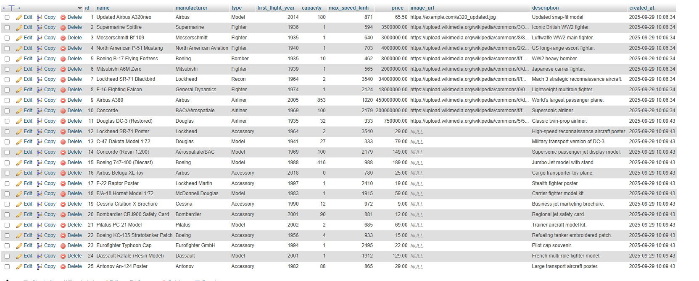
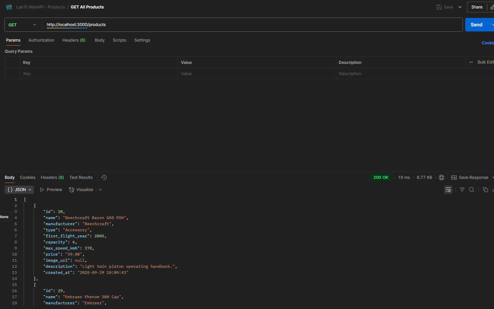
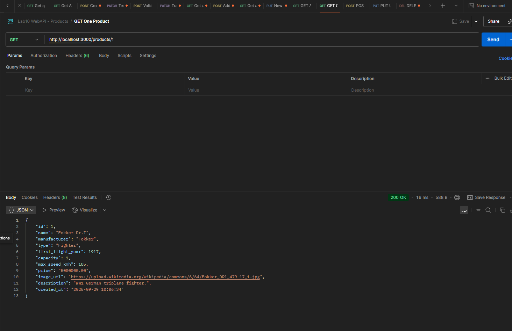
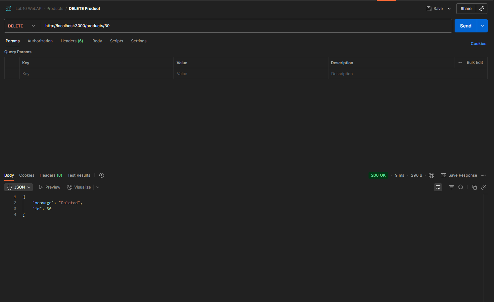

# Lab10 – Web API (Products) – Node.js + MySQL (XAMPP)

## 📌 รายละเอียดงาน
- สร้างฐานข้อมูล MySQL ขึ้นมาใหม่ (ชื่อ `lab10_airline`)
- สร้างตาราง `products` เก็บข้อมูลสินค้า (เครื่องบิน / model / accessory)
- เพิ่มข้อมูลสินค้า 20–30 รายการ (seed data มีแล้วใน `lab10_airline.sql`)
- พัฒนา Web API ด้วย Node.js + Express (เชื่อม MySQL บน XAMPP)
- API รองรับการทำงานเหมือน [FakeStore API](https://fakestoreapi.com/docs#tag/Products)  
  - **ดูทั้งหมด** (GET `/products`)  
  - **ดูทีละรายการ** (GET `/products/:id`)  
  - **เพิ่มสินค้า** (POST `/products`)  
  - **แก้ไขสินค้า** (PUT `/products/:id`)  
  - **ลบสินค้า** (DELETE `/products/:id`)  
- ส่งงานบน GitHub:  
  1. ไฟล์ฐานข้อมูล `.sql`  
  2. ไฟล์โปรเจ็กต์ API (`server.js`, `package.json`, `.env.example`)  
  3. README.md พร้อมวิธีใช้งานและภาพประกอบ  

--

## ⚙️ การติดตั้งและรันโปรเจ็กต์

### 1) เตรียมฐานข้อมูลใน XAMPP
1. เปิด XAMPP → Start **MySQL**
2. เข้า phpMyAdmin → Import → เลือกไฟล์ `lab10_airline.sql`
3. ตรวจสอบว่า DB `lab10_airline` ถูกสร้าง และมีตาราง `products`

### 2) ติดตั้งโปรเจ็กต์ Node.js
```bash
git clone https://github.com/<your-username>/lab10-webapi.git
cd lab10-webapi
npm install

สร้างไฟล์ .env

DB_HOST=127.0.0.1
DB_PORT=3306
DB_USER=root
DB_PASS=
DB_NAME=lab10_airline
PORT=3000

รัน API

npm start

--

## 📌 Endpoints

### phpMyAdmin


### Postman: GET all products


### Postman: POST new product


### Postman: PUT update product


### Postman: DELETE product

